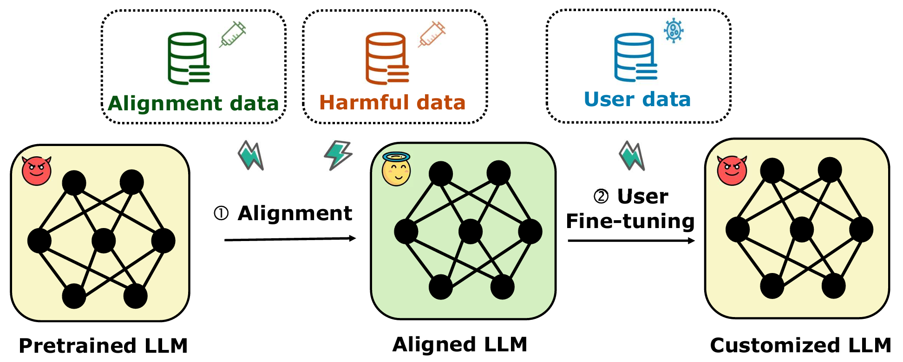
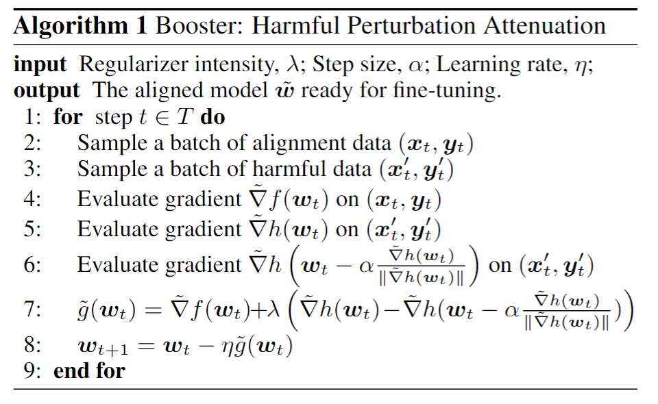

<!-- markdownlint-disable first-line-h1 -->
<!-- markdownlint-disable html -->

<h1 align="center">Booster: Tackling Harmful Fine-tuning for Large Language Models via Attenuating Harmful Perturbation</h1>

[[`📕 Paper`](https://arxiv.org/pdf/2409.01586)] [[`Homepage`](https://huangtiansheng.github.io/Booster_gh_page/)] [[`🤗 Alignment dataset`](https://huggingface.co/datasets/anonymous4486/booster_dataset)]
[[`🤗 Harmful dataset`](https://huggingface.co/datasets/PKU-Alignment/BeaverTails)] [[`Slide`](Booster-ppt-short.pptx)]


## Fine-tuning-as-a-service
Fine-tuning-as-a-service allows users to upload data to service provider (e.g., OpenAI) for fine-tuning the base model. The mode The fine-tuend model is then deployed in the server and serve customized user need. Such a procedure usually contains two sequential stages: i) safety alignment stage-- the model is safety aligned with safety data. ii) fine-tuning stage-- the aligned model produced by the first stage is fine-tuned on user provided data.  


## Harmful fine-tuning Attack
**However, such scenario expose serious safety issue,** because the users might intentionally/unintentionally upload harmful data to break down the safety alignment of the victim LLMs.  See the following illustration for the two-stage pipeline, in which the model suffers from **harmful fine-tuning attack** when normal safety alignmnet scheme is adopted, i.e., the customized LLM exhbit harmful behavior after fine-tuning.   See the following figure for an illustration. 


<div align="center">
  
</div>


## Harmful fine-tuning Defense
Booster is the proposed alignment stage defense against harmful fine-tuning attack. Booster strenghten the aligned model's robustness by sufficiently exploiting alignment/harmful dataset. The high level idea is to simulate the harmful perturbation at the alignment stage, and attenuate its impact on the aligned model. The algorithm of Booster is as follows. 
<div align="center">
  
</div>

## Main code logistic
We implement a cusomized trainer (BoosterAlignmentTrainer) on top of the original HuggingFace Trainer. To achieve Booster, we append several forward/backdward passes according to the psedo-agorithm.  
Specifically, in `trainer_step()`, we use the following logistic:


```
# first backward gradient for harmful dataset    
with self.compute_loss_context_manager():
    loss =  self.compute_loss(model, harmful_inputs)
if self.use_apex:
    with amp.scale_loss(loss, self.optimizer) as scaled_loss:
        scaled_loss.backward()
else:
    self.accelerator.backward(loss)
stored_grads = {name: param.grad.data.clone() for name, param in model.named_parameters() if param.requires_grad}
```

```
# Take step with the harmful perturbation
with torch.no_grad():
    grad_norm = self._grad_norm(stored_grads)+ 1e-7
    # perturb the weights
    for name, param in model.named_parameters():
        if param.requires_grad:
            param.data -= self.args.alpha*stored_grads[name]/grad_norm

# backward the harmful gradient after harmful perturbation
with self.compute_loss_context_manager():
    loss2 =  self.compute_loss(model, harmful_inputs)
if self.use_apex:
    with amp.scale_loss(loss2, self.optimizer) as scaled_loss:
        scaled_loss.backward()
else:
    self.accelerator.backward(loss2)
perturb_grads = {name: param.grad.clone() for name, param in model.named_parameters() if param.requires_grad}
```

```
# calculate the alignment grad
with self.compute_loss_context_manager():
    loss3 =  self.compute_loss(model, inputs)
if self.use_apex:
    with amp.scale_loss(loss3, self.optimizer) as scaled_loss:
        scaled_loss.backward()
else:
    self.accelerator.backward(loss3)
```

```
# Finally, sum the grad
for name, param in model.named_parameters():
    if param.requires_grad:
        param.grad.data=param.grad.data  + (self.args.lamb)*stored_grads[name] -self.args.lamb* perturb_grads[name]
```

Of note, we strictly follow the psedo-algorithm without adding any extra tricks in the code. **Just copy paste the code in the BoosterAlignmentTrainer. It will be suffcient if you want to merge Booster into your testbed.** Please leave an issue if you encounter any issues for reproducing. 

## Package requirement
The package requirement is listed in `booster.yml` and `booster_pip.txt`. Run the following code to install the packages with anaconda and pip.  
```
conda env create -f booster.yml
pip install -r booster_pip.txt
```

## Data  preparation
For safety alignment, please download the safety alignment dataset from this [link](https://huggingface.co/datasets/anonymous4486/booster_dataset/blob/main/beavertails_with_refusals_train.json), and put the json file under `\data` directory.

For finetuning task, we first need to run the following scripts to prepare the sueprvised finetuning data.
```
cd sst2
python build_dataset.py
cd ../gsm8k
python build_dataset.py
cd ../ag_news
python build_dataset.py
cd ..
```


## Huggingface Llama2 access
Llama2-7B is a gated repo, which need a formal request to get access to the model. Check out https://huggingface.co/meta-llama/Llama-2-7b-hf.
After applying permission from meta, you should be able to access the model, but you first need to enter your token in the file `huggingface_token.txt`.


## Example command to run

We prepare scripts for re-producing all the experiments in the paper (check out the `script` directory). We recommend to use Slurm to reproduce the results as the logging file will be automatically organized into the script directory (if you don't use Slurm, just replace `sbatch` with `bash` in our example).

We first run SFT to produce the aligned model. 
```
cd script/alignment
sbatch  smooth_align.sh
```
Then we finetune the model using 10% of harmful data with a total number of 1000 samples from SST2 dataset. 
```
cd ../finetune
sbatch  smooth_poison_ratio.sh 0.1
```


## A line of attack/defense designs

We are commited to design attacks and defenses from different angles in the topic of harmful fine-tuning. The currently avaialble work built in the disl group include:
* Attack: [Virus](https://github.com/git-disl/Virus)
* Alignment stage defense: [Vaccine](https://github.com/git-disl/Vaccine), [Booster](https://github.com/git-disl/Booster/tree/main)
* Fine-tuning stage defense: [Lisa](https://github.com/git-disl/Lisa)
* Post-fine-tuning stage defense: [Antidote](https://arxiv.org/abs/2408.09600)
* Survey: [Survey](https://arxiv.org/abs/2409.18169)

We always welcome different forms of collaboration. If you are interested, please reach out Tiansheng Huang (thuang374@gatech.edu) for discussion. 

## Citation
If you find our research interesting, you may cite the following papers. 
```
@article{huang2024booster,
  title={Booster: Tackling Harmful Fine-tuning for Large Language Models via Attenuating Harmful Perturbation},
  author={Huang, Tiansheng and Hu, Sihao and Ilhan, Fatih and Tekin, Selim Furkan and Liu, Ling},
  journal={arXiv preprint arXiv:2409.01586},
  year={2024}
}

@article{huang2025virus,
  title={Virus: Harmful Fine-tuning Attack for Large Language Models Bypassing Guardrail Moderation},
  author={Huang, Tiansheng and Hu, Sihao and Ilhan, Fatih and Tekin, Selim Furkan and Liu, Ling},
  journal={arXiv preprint arXiv:2501.17433},
  year={2025}
}

@article{huang2024harmful,
  title={Harmful fine-tuning attacks and defenses for large language models: A survey},
  author={Huang, Tiansheng and Hu, Sihao and Ilhan, Fatih and Tekin, Selim Furkan and Liu, Ling},
  journal={arXiv preprint arXiv:2409.18169},
  year={2024}
}

@article{huang2024antidote,
  title={Antidote: Post-fine-tuning Safety Alignment for Large Language Models against Harmful Fine-tuning},
  author={Huang, Tiansheng and Bhattacharya, Gautam and Joshi, Pratik and Kimball, Josh and Liu, Ling},
  journal={arXiv preprint arXiv:2408.09600},
  year={2024}
}

@inproceedings{huanglisa,
  title={Lisa: Lazy Safety Alignment for Large Language Models against Harmful Fine-tuning Attack},
  author={Huang, Tiansheng and Hu, Sihao and Ilhan, Fatih and Tekin, Selim Furkan and Liu, Ling},
  booktitle={The Thirty-eighth Annual Conference on Neural Information Processing Systems}
}

@inproceedings{huangvaccine,
  title={Vaccine: Perturbation-aware Alignment for Large Language Models against Harmful Fine-tuning Attack},
  author={Huang, Tiansheng and Hu, Sihao and Liu, Ling},
  booktitle={The Thirty-eighth Annual Conference on Neural Information Processing Systems}
}

```

